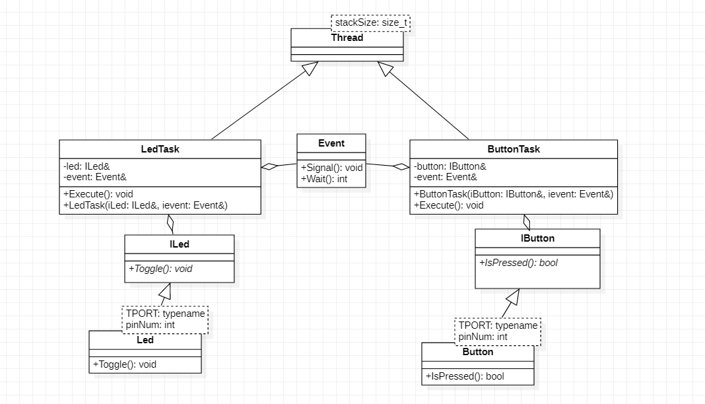

== _RTOS_ в IAR Embedded Workbench

---

=== _Задание:_

Создать программу, которая будет управлять светодиодом через классы.

=== *Выполнение работы:*

Создадим архитектуру проекта в _StarUML_ :

.Архитектура проекта

В архитектуре описаны классы и методы для работы программы. *Event* - класс, связывающий ветви архитектуры, благодаря которому можно узнать произошло ли событие и дальше выполнять команды.

Ниже представлены файлы с кодом программы:
[source, cpp]
----
Led.hpp

#pragma once
#include "ILed.hpp"

template<typename TPORT, int pinNum>
class Led : public ILed
{
public:
  void Toggle() override
  {
    TPORT::ODR::Toggle(1 << pinNum);
  }
};

----

[source, cpp]
----
ILed.hpp

#pragma once
class ILed
{
  public:
    virtual void Toggle() = 0;
};

----

[source, cpp]
----
LedTask.hpp

#pragma once
#include "ILed.hpp" //for Iled
#include "thread.hpp" //for thread
#include "event.hpp"
using namespace OsWrapper;
class LedTask : public Thread<128U>
{
public:
    void Execute() override;
    LedTask(ILed& Lled, std::chrono::milliseconds aPeriod, Event& ievent);
private:
  ILed& led;
  Event& event;
  std::chrono::milliseconds period;
};
----

[source, cpp]
----
button.hpp

#pragma once
#include "Ibutton.hpp"
template<typename TPORT, int pinNum>
class Button : public IButton
{
public:
  bool IsPressed() override
  {
    return !(TPORT::IDR::Get() & (1 << pinNum));
  }

};

----

[source, cpp]
----
Ibutton.hpp

#pragma once
class IButton
{
  public:
    virtual bool IsPressed() = 0;
};
----

[source, cpp]
----
ButtonTask.hpp

#pragma once
#include "Ibutton.hpp" //for Iled
#include "thread.hpp" //for thread
#include "event.hpp"
using namespace OsWrapper;
class ButtonTask : public Thread<128U>
{
public:
  ButtonTask(IButton& aButton, Event& ievent);
  void Execute() override;
private:
  IButton& button;
  Event& event;};
----

[source, cpp]
----
ButtonTask.cpp

#include "ButtonTask.hpp"
ButtonTask::ButtonTask(IButton& aButton, Event& ievent) : button(aButton), event(ievent)
{}
void ButtonTask::Execute()
{
  for(;;)
  {
    if(button.IsPressed())
    {event.Signal();
    }
     Sleep(300ms) ;
  }
}
----

